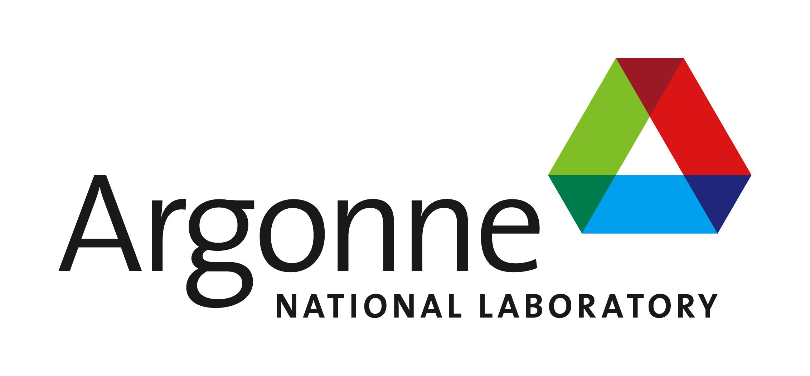

  

  

We are working with researchers at Argonne National Lab to build a tool that uses machine learning models to effectively and accuratley predict the formation energy and transition energy levels of novel impurity doped II-VI, III-V, and IV-IV semiconductors and their alloys. This project aims to assist scientists and researchers in the field of semiconductor research as they explore novel materials with targeted optoelectronic properties. We are currently building three different machine learning models based on Lasso Ridge Regression, Random Forest Regression and Neural Networks.

### Repository Structure
- ai_semiconductors
  - Feature Selection
  - ModelExploration
  - OutlierDetection
  - static
- doc

### Authors
- Robert Biegaj
- Xiaofeng Xiang
- Laura Jacoby

### License
This project is licensed under the MIT License - see LICENSE.md for details.

### Acknowledgments
The data to train our machine learning models came from our project supervisors at ANL. They also contribute guidance and support in building our machine learning tools.

This project is part of the UW DIRECT Capstone 2020, and is supported by Argonne National Lab.
 
